# 01-MongoDB数据库介绍


* **在刚开始学习MongoDB数据库的时候，关于数据库可能会有一些比较多的概念性的名词解释，大家只做了解即可，只需要记住一点，只要是数据库，不管是基于什么平台什么类型，都离不开这四个字：增删改查**

  * **只要我们能够使用数据库实现增删改查，那么这个数据库你就已经学会了90%**

* MongoDB 是一个基于分布式文件存储的数据库。由 C++ 语言编写。旨在为 WEB 应用提供可扩展的高性能数据存储解决方案。 MongoDB 是一个介于关系数据库和非关系数据库之间的产品，是非关系数据库当中功能最丰富，最像关系数据库的。

  * MongoDB属于非关系型数据库（无需sql语句 CREATE FIND UPDATE DELETE）

* MongoDB官网：<https://www.mongodb.com/>

* MongoDB推荐学习地址：菜鸟教程:

  http://www.runoob.com/mongodb/mongodb-tutorial.html

  * 菜鸟只是别人谦虚的一种叫法，在这里虽然学习不到开发技巧和经验，但是学习或者查询API还是非常有用的


# 02-MongoDB数据库环境搭建


## 1.1-win8以上系统安装方式


* 打开其他资料->教学软件->mongodb数据库安装包
  * 直接双击即可

* 只要任务管理器出现mongod的服务就表示安装成功

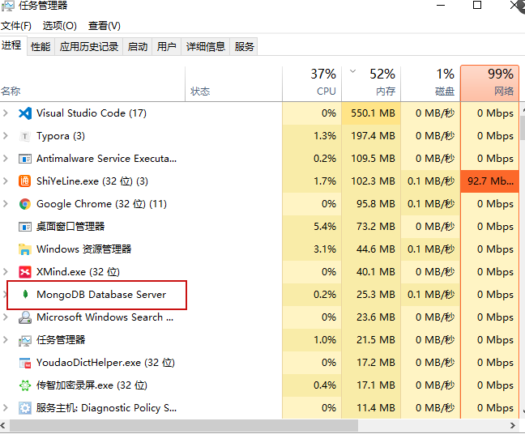

## 1.2-win8及以下系统安装方式

打开其他资料->教学软件->mongodb的win7古董机专用文件夹


* 1.选择自己的操作系统位数对应安装
  * 如果是32位操作系统，则需要安装第三个文件(window系统补充文件)


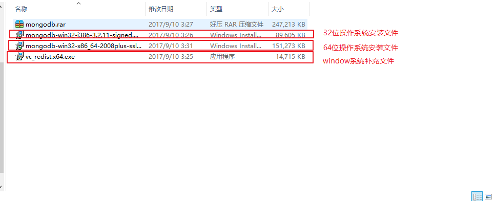

* 2.开始安装


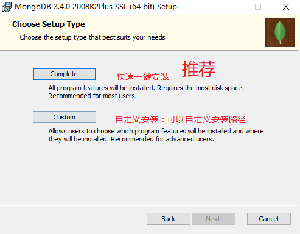


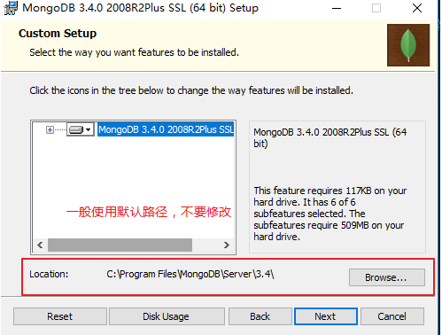


* 3:手动在C盘根目录创建文件夹：  `data/db`

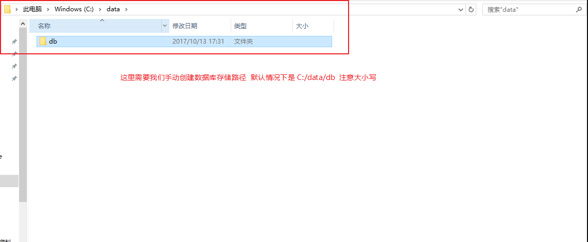

* 4.启动数据库
  * a.先在终端cd进入你的安装包bin文件夹： `cd C:\Program Files\MongoDB\Server\3.4\bin`
  * b.然后输入命名`mongod` 回车
  * **当出现等待连接27107的端口时，表示此时数据库服务开启成功waiting for connections on port 27017**


* 与NodeJS一样使用`ctrl + c`命令关闭数据库


## 1.3-32位操作系统报错解决方案


* **一般windows8以上没有什么，win7版本下某一个版本之前会丢失一个补丁导致无法安装，如果出现该报错则安装课程资料中的redist.x64.exe即可**


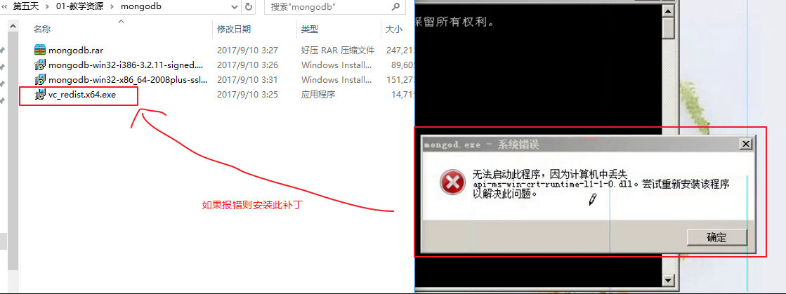


*如果安装之后还报错，说明你的电脑系统版本实在过低，建议升级一下电脑系统，这里本人提供一个非常好用的网址*

* 我告诉你:

  https://msdn.itellyou.cn/

  * 可下载windows所有资源：系统（所有的版本，包含不更新的XP）、应用程序、工具资源等
  * 均为免费纯净版，不用担心恶意软件和病毒


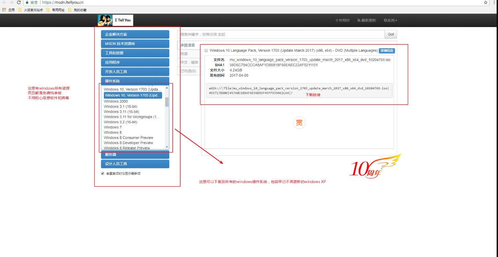


# 03-MongoDB数据库可视化工具Robo 3T使用


* **Robo 3T类似于mysql的navicat可视化工具**

robomongo官网地址:<https://robomongo.org/>

* robomongo有两个版本，下哪个都可以(在第五天其他资料总已经有下载好的Studio 3T版本)
* Robo 3T:基础免费版
  * 基本够用
* Studio 3T：专业版
  * 收费版本


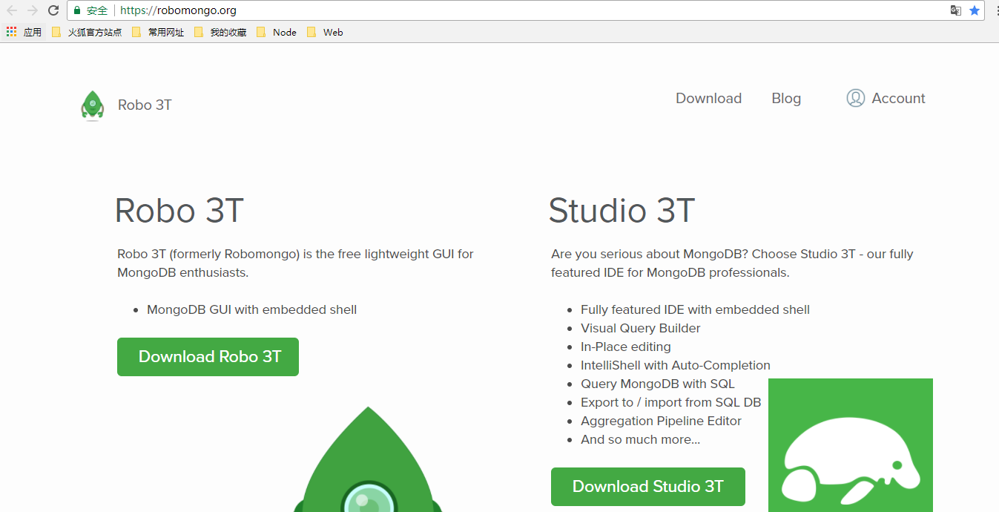


## 1.1-安装


* 打开其他资料->教学软件->robo 3T.exe 直接双击安装即可
  * 如果出现下图提示，点左边这个


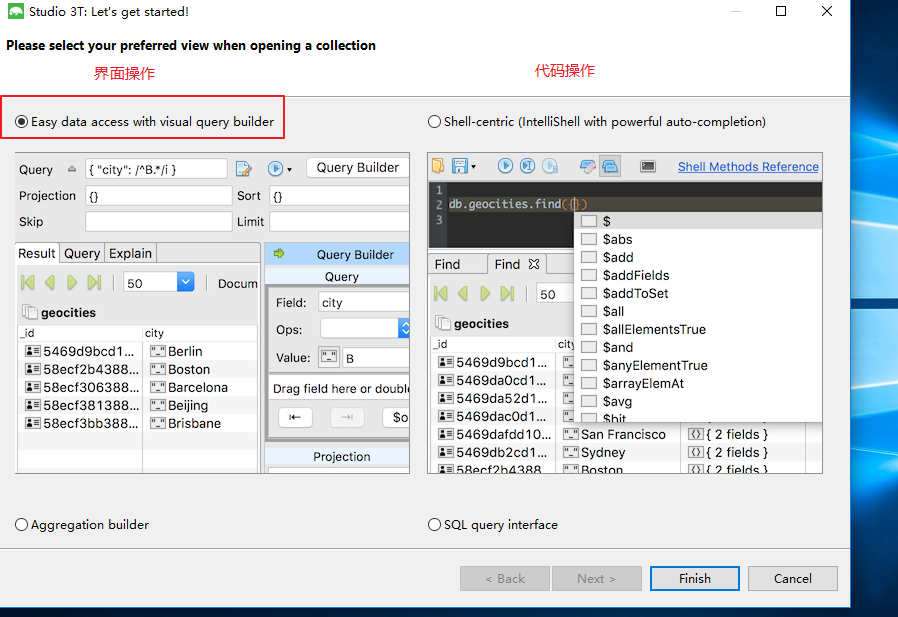


## 1.2-连接mongoDB数据库


* ***默认情况下，只要你安装了mongoDB数据库，进入这个软件时会自动帮你创建了连接***

  

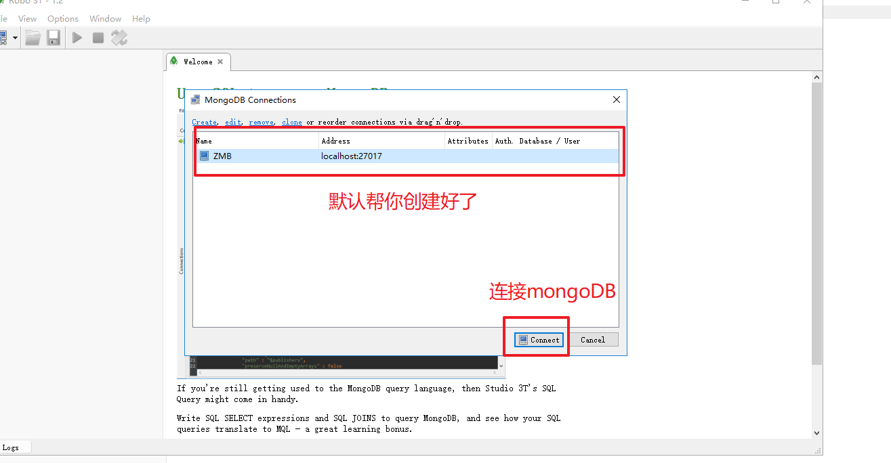


* **如果没有，也可以手动创建连接**

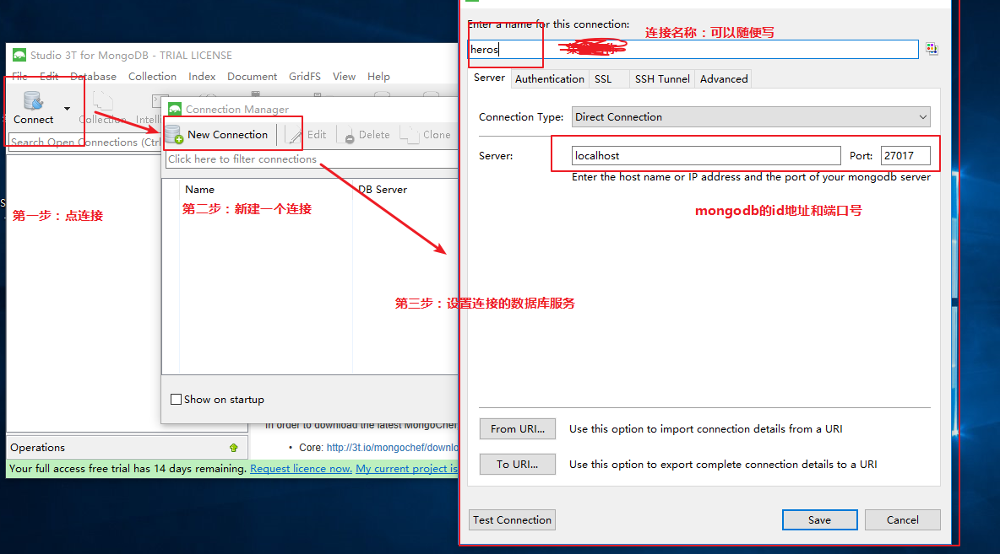


* 连接成功，就可以开始使用了

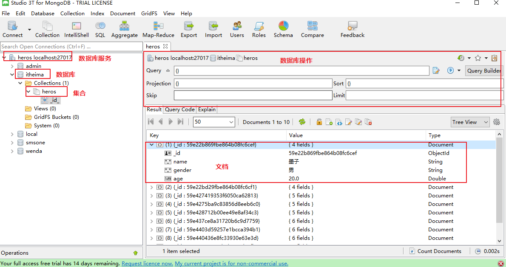


## 1.3-基本使用

**这里只是简单介绍一下，我们学习的重心还是使用代码操作数据库，robomongo只充当更加直观查看我们代码效果的作用**

* 1.增删改查操作

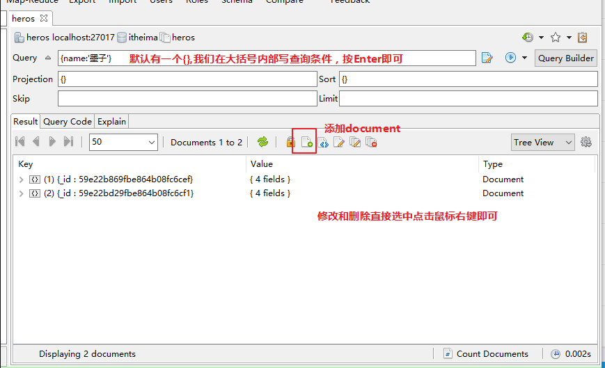

* 2.修改显示样式

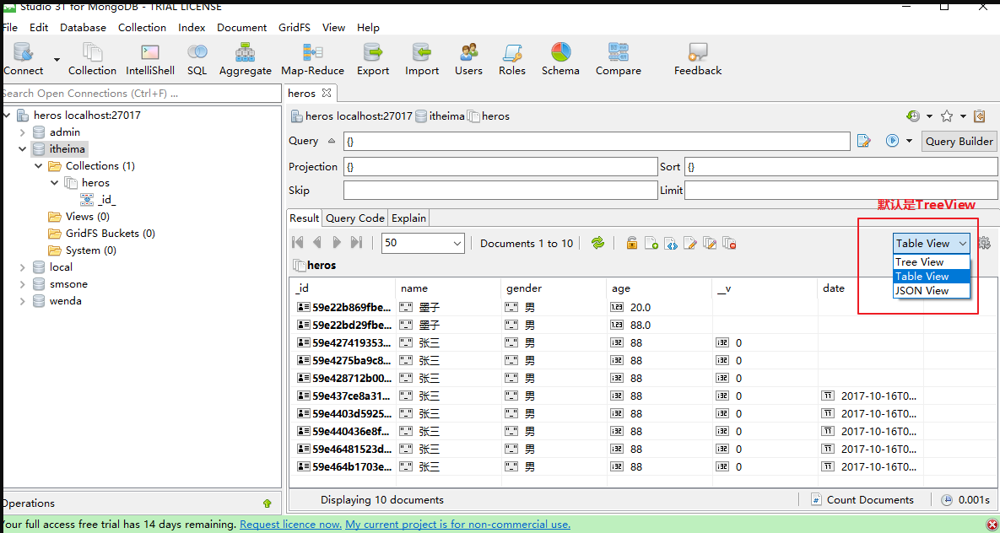


* 4.细节注意
  * 当我们通过代码修改数据库之后，软件并不会自动刷新，需要我们手动点击刷新按钮

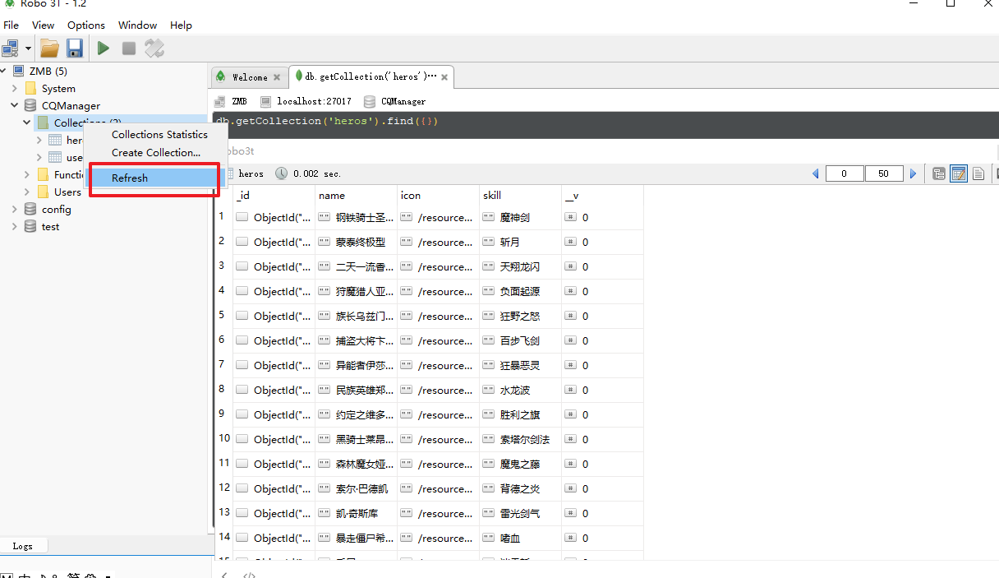


# 04-第三方模块mongoose使用


* mongodb:是一个数据库软件（相当于数据库服务器）
* robo 3t:是一个数据库可视化工具，相当于利用软件来操作数据库（为了演示）
* mongoose:是nodejs中第一个重量级的第三方模块，作用是用js代码来操作mongodb数据


* **mongoos是mongodb中一个基于ORM（object relationship mapping：对象关系映射，这是一种将面向对象思维结合到数据库的编程思想）的库**
  * ORM的好处：我们无心关心数据库，只需要操作对象即可（对象自身即可实现增删改查）
* 基于ORM的存储方式的优化
  * Schema：自定义数据存储结构
  * Model：对象模型
    * 相当于mongodb中的集合
  * Document：又称之为实体Entity，相当于mongodb中的Document（关系型数据库中的记录，每一行的数据）

## 1.1-mongoose快速入门


* npm网址:<https://www.npmjs.com/package/mongoose>
* github网址：<https://github.com/Automattic/mongoose>
* monggse官网;<http://mongoosejs.com/>

* 1.mongoose官网是这么介绍自己的：Mongoose is a MongoDB object modeling tool designed to work in an asynchronous environment.
  * mongoose是基于mongodb封装的在异步环境中工作的对象模型工具
    * （1）异步环境：提高性能
    * （2）对象模型工具：一种全新的ORM思维去操作数据库
* 2.安装mongoose
  * `npm install mongoose`
* 3.快速入门
  * **官方文档提供的代码复制粘贴即可**

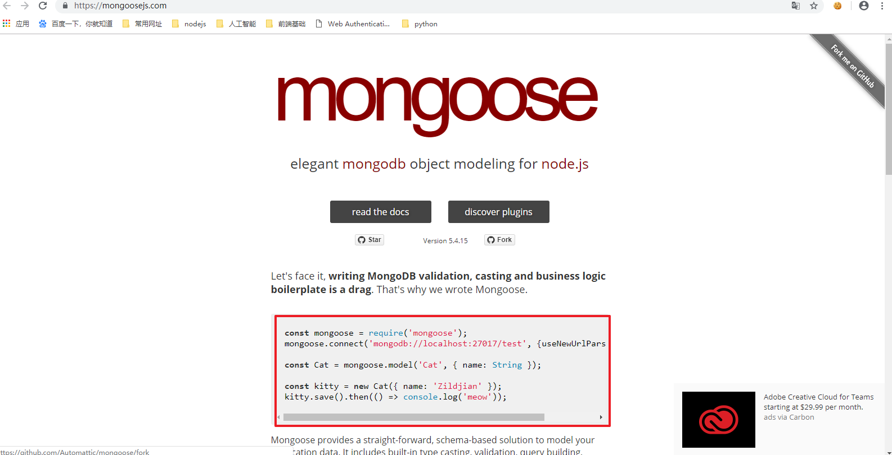


```javascript
//1.导入模块
const mongoose = require('mongoose');
//2.连接数据库
/*
27017：mongodb数据库默认端口号  不要改
test：你要连接的数据库名字  有则连接，无则创建 
 */    
mongoose.connect('mongodb://localhost:27017/test', {useNewUrlParser: true});

//3.创建Model（相当于table表）
//第一个参数：Model名称  第二个参数：表中存储数据的结构Schema
const Cat = mongoose.model('Cat', { name: String });

//4.创建Entity（相当于table表中插入一条数据）
const kitty = new Cat({ name: 'Zildjian' });

//5.插入数据
kitty.save().then(() => console.log('meow'));
```


## 1.2-mongoose存储结构介绍


* 数据库结构介绍
* 数据库服务(mySql、mongodb：一个数据库服务可以有很多个数据库)
  * 数据库1：CQManager(一个数据库下可以有很多张表)
    * 表1：cats(一个表中可以有很多个数据   mysql:表table；  mongodb：集合collections； mongoos：模型Model)
      * 记录1：（一个记录可以有很多个列，  mysql：记录 ； mongodb：文档document；mongoose：实体 Entity）
        * 第一个数据
          * 名字:小花
          * 颜色：红色
        * 第二个数据
          * 名字:小白
          * 颜色：白色
      * 记录2
    * 表2：dogs
  * 数据库2:  test


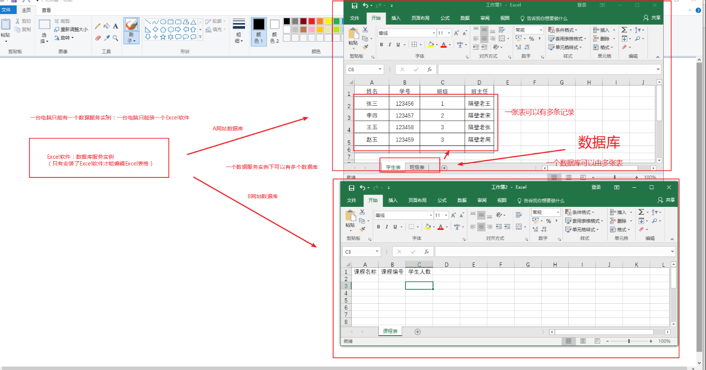


## 1.3-mongoose使用流程介绍


```javascript
//1.导入模块
const mongoose = require('mongoose');

//2.连接数据库 heima:数据库名字
mongoose.connect('mongodb://127.0.0.1:27017/heima');

//3.创建Model
/* 
第一个参数：模型名称（table表名）
第二个参数：模型中的数据结构(table表中数据结构)
返回值：model对象，负责table的增删改查操作
*/
let student = mongoose.model('students',{name:String,age:Number});
```


## 1.4-mongoose增删改查操作介绍

* ***在mongoose中，增删改查操作由模型Modle完成（相当于mysql中的表，也相当于js中的类（构造函数））***
  * 而表中的每一条数据，在mongoose中变成了对象


```javascript
//1.导入模块
const mongoose = require('mongoose');

//2.连接数据库
mongoose.connect('mongodb://127.0.0.1:27017/heima');

//3.创建Model
/* 
第一个参数：模型名称（table表名）
第二个参数：模型中的数据结构(table表中数据结构)
返回值：model对象，负责table的增删改查操作
*/
let student = mongoose.model('students',{name:String,age:Number});


/***********          增加操作            ***********/

/* 
第一个参数：要插入的数据  
    如果只插入一条数据：则传单个对象
    如果要插入多条数据：则传数组
第二参数：回调函数
    * err: 如果为null，表示插入成功。 否则插入失败
*/

// student.create([{name:'张三',age:18},{name:'李四',age:20}],(err)=>{
//     if(err){
//         console.log('插入失败' + err);
        
//     }else{
//         console.log('插入成功');
        
//     };
// });

/***********          删除操作            ***********/
/*删除满足条件的第一个数据
第一个参数：查询条件
第二个参数：回调函数 err：错误信息 
 */
// student.deleteOne({name:'张三'},(err)=>{
//     if(err){
//         console.log('删除失败');
//     }else{
//         console.log('删除成功');  
//     };
// });

//删除满足条件所有数据
// student.deleteMany({name:'张三'},(err)=>{
//     if(err){
//         console.log('删除失败');
//     }else{
//         console.log('删除成功');  
//     };
// });

/*******          修改数据               **********/

/*修改满足条件第一条数据
第一个参数：查询条件
第二个参数：要修改的数据
第三个参数：回调函数 
 */
// student.updateOne({name:'李四'},{name:'王五',age:88},(err)=>{
//     if(err){
//         console.log('修改失败');
//     }else{
//         console.log('修改成功');
//     }
// });

//修改满足条件所有数据
// student.updateMany({name:'李四'},{name:'王五',age:88},(err)=>{
//     if(err){
//         console.log('修改失败');
//     }else{
//         console.log('修改成功');
//     }
// });

/*******          查询数据               **********/

/*查询满足条件所有数据
第一个参数：查询条件
第二个参数：查询回调  err：错误信息  res：查询结果 
 */
student.find({name:'王五'},(err,res)=>{
    if(err){
        console.log('查询失败');
        
    }else{
        console.log(res);
        
    }
});

//只想查询满足条件第一个数据  student.findOne()

//通过数据唯一ID来查询
student.findById('5c6aa1953753d11b9824b93c',(err,res)=>{
    if(err){
        console.log(err);
    }else{
        console.log(res);
    }
});

```


# 05-mongoose实战练习：爬虫入库


* 需求：利用crawler模块爬取真实网站游戏`CQ战记`的数据，使用mongoose存入mongodb数据库
  * http://wiki.joyme.com/cq/


## 1.1-使用mongoose封装一个M层（增删改查数据）


```javascript
//1.导入模块
const mongoose = require('mongoose');

//2.连接数据库
mongoose.connect('mongodb://127.0.0.1:27017/CQManager');

//3.创建Model
/* 
第一个参数：模型名称（table表名）
第二个参数：模型中的数据结构(table表中数据结构)
返回值：model对象，负责table的增删改查操作
*/
let hero = mongoose.model('hero',{name:String,icon:String,skill:String});


//导出模块
//导出hero对象：因为数据库增删改查操作是由模型对象hero负责
module.exports = hero;
```


## 1.2-使用crawler爬取网站数据存入数据库

* 安装:` cnpm i crawler --save`

* 思路：
  * 爬取到整个网页之后，使用jquery语法解析页面获取想要的数据

```javascript
//1.导入模块
const Crawler = require("crawler");
const heroModel = require('./heroModel.js');

//2.创建抓包对象 
let c = new Crawler({
    maxConnections : 10,
    // 抓包回调：抓取成功之后会执行这个回调函数
    callback : function (error, res, done) {
        if(error){
            console.log(error);
        }else{
            //将抓取到的页面赋值给jquery的$对象
            var $ = res.$;
            // $ is Cheerio by default
            //a lean implementation of core jQuery designed specifically for the server
            // console.log($("html").html());
            //使用juqery语法解析页面
            console.log($('#hero_list tr').length);
            //将解析出来的数据放到数组里，一次性存入数据库
            //1.声明空数组
            var heroArr = [];
            //2.开始解析
            $('#hero_list tr').each((index,element)=>{
                var heroName = $(element).find('td>a').text();
                console.log(heroName);
                
                var heroIcon = $(element).find('td>.hero-icon img').attr('src');
                console.log(heroIcon);

                var heroSkill = $(element).find('td.mwiki-hide .name>a').text();
                console.log(heroSkill);

                //3.存入数组
                heroArr.push({
                    name:heroName,
                    icon:heroIcon,
                    skill:heroSkill
                });
                console.log(heroArr);
            });
            //3.将数组中的所有数组存入数据库
            //第一个数组是thead中的数据，需要去掉
            heroArr.shift();
            heroModel.create(heroArr,(err)=>{
                if(err){
                    throw err;
                }else{
                    console.log('插入成功');
                    
                }
            })
            
        }
        done();
    }
});
 
// Queue just one URL, with default callback
//3.开始抓包
c.queue('http://wiki.joyme.com/cq/%E5%89%91%E5%A3%AB');
```


## 1.3-使用crawler爬取网站图片文件存入数据库


```javascript
var Crawler = require("crawler");
var fs = require('fs');
 
var c = new Crawler({
    encoding:null,
    jQuery:false,// set false to suppress warning message.
    callback:function(err, res, done){
        if(err){
            console.error(err.stack);
        }else{
            console.log(res.options);
            
            fs.createWriteStream(res.options.filename).write(res.body);
        }
        
        done();
    }
});
 
c.queue({
    uri:'http://upos-hz-mirrorks3u.acgvideo.com/upgcxcode/67/42/73284267/73284267-1-6.mp4?e=ig8euxZM2rNcNbug7WdVtWug7WdVNEVEuCIv29hEn0l5QK==&deadline=1550509552&gen=playurl&nbs=1&oi=3746207702&os=ks3u&platform=html5&trid=363b50b3a99e42ef92c5ebdfcdd5aae5&uipk=5&upsig=17cc9aef1eedacf055875b32c48dd5aa',//文件地址
    filename:"./images/1111.mp4",//文件路径名  
    headers:{'User-Agent': 'requests'}//反爬虫：伪装这个请求是浏览器发出来的
});
```


## 1.4-使用crawler同时爬取文本数据和图片数据存入数据库

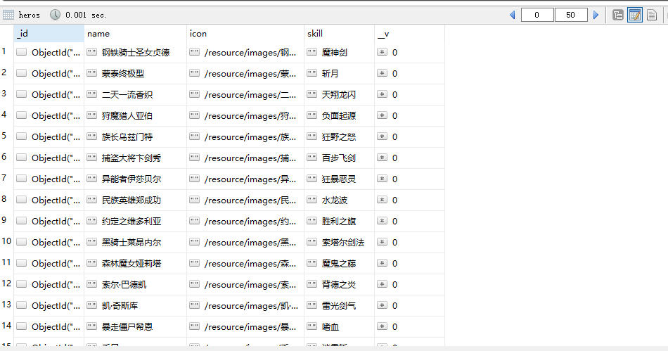

```javascript
//1.导入模块
const Crawler = require("crawler");
const fs = require('fs');
const heroModel = require('./heroModel.js');

//2.创建抓包对象 (抓数据)
let dataC = new Crawler({
    maxConnections : 10,
    // 抓包回调：抓取成功之后会执行这个回调函数
    callback : function (error, res, done) {
        if(error){
            console.log(error);
        }else{
            //将抓取到的页面赋值给jquery的$对象
            var $ = res.$;
            // $ is Cheerio by default
            //a lean implementation of core jQuery designed specifically for the server
            // console.log($("html").html());
            //使用juqery语法解析页面
            console.log($('#hero_list tr').length);
            //将解析出来的数据放到数组里，一次性存入数据库
            //1.声明空数组
            var heroArr = [];
            //2.开始解析
            $('#hero_list tr').each((index,element)=>{
                var heroName = $(element).find('td>a').text();
                console.log(heroName);
                
                var heroIcon = $(element).find('td>.hero-icon img').attr('src');
                console.log(heroIcon);
                //顺便把图片路径对应的图像也抓上来
                //文件路径名，与名字对应
                let fileName = "./images/"+heroName+".png";
                fileC.queue({
                    uri:heroIcon,
                    filename:fileName,  
                   
                });

                var heroSkill = $(element).find('td.mwiki-hide .name>a').text();
                console.log(heroSkill);

                //3.存入数组
                heroArr.push({
                    name:heroName,
                    icon:'/resource/images/' + heroName + '.png',//数据库不存CQ网站的路径，存我们自己服务器的文件路径
                    skill:heroSkill
                });
                console.log(heroArr);
            });
            //3.将数组中的所有数组存入数据库
            //第一个数组是thead中的数据，需要去掉
            heroArr.shift();
            heroModel.create(heroArr,(err)=>{
                if(err){
                    throw err;
                }else{
                    console.log('插入成功');
                };
            })
            
        }
        done();
    }
});

//创建抓包对象 (抓图像)
var fileC = new Crawler({
    encoding:null,
    jQuery:false,// set false to suppress warning message.
    callback:function(err, res, done){
        if(err){
            console.error(err.stack);
        }else{
            console.log(res.options);
            //写入文件
            fs.createWriteStream(res.options.filename).write(res.body);
        }
        
        done();
    }
});
 
// Queue just one URL, with default callback
//3.开始抓包
dataC.queue('http://wiki.joyme.com/cq/%E5%89%91%E5%A3%AB');
```


# 06-CQManager综合项目介绍


* 1.开发环境
  * Nodejs平台+express框架+MVC架构+mongodb数据库搭建服务端平台
* 2.技术栈
  * 1.分页功能
  * 2.搜索功能
  * 3.文件上传
  * 4.前端文件预览/获取文件尺寸/获取文件大小
  * 5.验证码功能
  * 6.登录注册加密流程
  * 7.用户会话保持原理及流程
* 3.项目开发流程介绍
  * 1.使用MVC设计模式搭建项目架构
    * app.js:服务器入口
    * router:路由分发
    * C层：处理业务逻辑
    * M层：处理数据（增删改查数据库）
    * V层：静态HTML文件
    * resource：静态资源（图片等资源）
  * 2.express框架搭建服务器入口文件
    * 1.导入模块
    * 2.创建服务器
    * 3.配置中间件
      * 托管静态资源
      * body-parser：解析post请求参数
      * serve-favicon：网站图标
      * multer:文件上传
      * cookie-session中间件：用户会话保持
      * 路由中间件
    * 4.开启服务器
  * 3.路由分发给C层
  * 4.C层处理业务逻辑
    * 英雄模块
      * /：重定向技术显示首页
      * /heroList:获取所有英雄列表
      * /heroPage:分页查询英雄列表
      * /heroSearch:搜索英雄
      * /heroAdd：添加英雄
      * /heroInfo:查询英雄
      * /heroUpdate:编辑英雄
      * /heroDelete:删除英雄
    * 用户模块
      * /register:注册
      * /login:登录
      * /logout:登出
      * /captcha:验证码
  * 5.M层搭建mongoose数据库增删改查操作mongodb


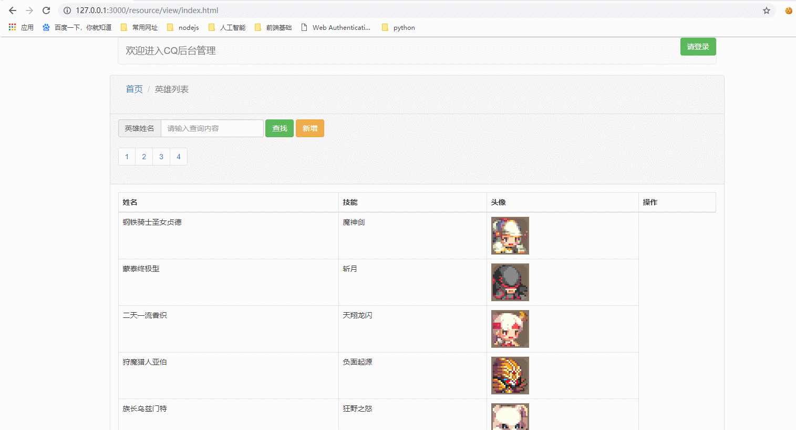


* 前后端完整代码(老师备课用)

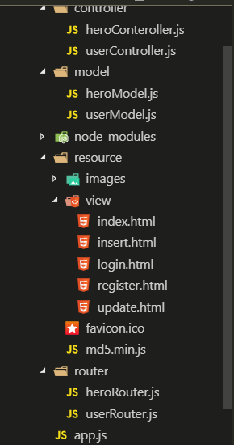

### 服务端

* 需要安装的模块
  * jquery
  * bootstrap
  * art-template
  * express
  * mongoose
  * body-parser
  * serve-favicon
  * multer
  * cookie-session
  * svg-captcha

### 1.app.js

```javascript
//1.导入模块
const express = require('express');
//2.创建服务器
let app = express()

//3.配置中间件

//3.1 托管静态资源
app.use('/node_modules', express.static(__dirname + '/node_modules'));
app.use('/resource', express.static(__dirname + '/resource'));

//3.2 body-parser：解析body
var bodyParser = require('body-parser');
// parse application/x-www-form-urlencoded
//以后所有的req都会有一个body属性，就是解析好的post参数对象
app.use(bodyParser.urlencoded({ extended: false }));
//3.3 serve-favicon:自动返回网站图标
var favicon = require('serve-favicon');
var path = require('path');
app.use(favicon(path.join(__dirname, 'resource', 'favicon.ico')));
//3.4 express-fileupload：接收文件数据
const fileUpload = require('express-fileupload');
app.use(fileUpload());

//3.5 cookie-session中间件:保持会话状态
//一旦配置成功：req就会有一个session属性用来响应给客户端cookie
var cookieSession = require('cookie-session');
app.use(cookieSession({
    name: 'adskljvgkldagvwd',
    keys: ['wskalevbklsabvlkjs'],//加密的密钥
    // Cookie Options
    maxAge: 24 * 60 * 60 * 1000 // 24 hours   有效期
  }));


  
//写一个中间件查看以下用户的cookie
app.use((req,res,next)=>{
  console.log(req.session);
  next();
});

//路由中间件一般写在其他中间件后面（因为中间件从上往下匹配）
app.use(require('./router/heroRouter.js'));
app.use(require('./router/userRouter.js'));

console.log(app == require('./router/heroRouter.js'));//false


//4.开启服务器
app.listen(3000,()=>{
    console.log('欢迎来到CQ荣耀');
});
```


### 2.heroRouter.js

```javascript
//1.导入express
const express = require('express');
//2.创建路由app
let app = express();

//分发请求给C层
const heroController = require('../controller/heroConteroller.js');
app.get('/',heroController.showHeroList)//重定向显示首页
.get('/heroList',heroController.getHeroList)//获取所有英雄列表
.get('/heroPage',heroController.getHeroPageList)//分页查询英雄列表
.get('/heroSearch',heroController.getHeroSearchList)//搜索英雄
.post('/heroAdd',heroController.doHeroAdd)//添加英雄
.get('/heroInfo',heroController.getHeroInfo)//查询英雄
.post('/heroUpdate',heroController.doHeroUpdate)//编辑英雄
.get('/heroDelete',heroController.doHeroDelete);//删除英雄

//3.导出路由
module.exports = app;
```


### 3.userRouter.js


```javascript
//1.导入express
const express = require('express');
//2.创建路由app
let app = express();

//分发请求给C层
const userController = require('../controller/userController.js');
app.post('/register',userController.register)
.post('/login',userController.login)
.get('/logout',userController.logout)
.get('/captcha',userController.captcha);

//3.导出路由
module.exports = app;
```


### 4.heroController.js

```javascript
/* C层：处理业务逻辑（M层与V层的沟通） */

//导入M层
const heroModel = require('../model/heroModel.js');
const userModel = require('../model/userModel.js');
//导出C层
module.exports = {
    showHeroList: (req, res) => {
        //重定向刷新首页
        res.writeHead(302, {
            'Location': '/resource/view/index.html'
        });
        res.end();
    },
    getHeroList: (req, res) => {
        //查询首页英雄列表
        heroModel.find((err, docs) => {
            if (err) {
                res.send({
                    err_code: 500,
                    err_msg: err
                });
            } else {
                //1.计算页数(一页10个)
                let pageCount = Math.ceil(docs.length / 10);
                //2.返回客户端 第一页数据 和 页数
                res.send({
                    heros: docs.slice(0, 10),
                    pageCount,
                    user: req.session.user //将浏览器的cookie响应给客户端
                });
            }
        });
    },
    getHeroPage: (req, res) => {
        //1.获取请求参数 get
        console.log(req.query);
        let page = req.query.page;
        //2.处理:查询数据
        heroModel.find((err, docs) => {
            if (err) {
                res.send({
                    err_code: 500,
                    err_msg: err
                });
            } else {
                //响应返回指定页数
                res.send({
                    heros: docs.slice((page - 1) * 10, page * 10)
                });
            };
        })
    },
    getHeroSearch: (req, res) => {
        console.log(req.query);
        //1.获取请求参数
        let searchTxt = req.query.search;
        //2.查询
        //mongoose支持正则查询
        let re = new RegExp(searchTxt, 'i');
        heroModel.find({
            name: re
        }, (err, docs) => {
            console.log(docs);
            if (err) {
                res.send({
                    err_code: 500,
                    err_msg: err
                });
            } else {
                res.send({
                    heros: docs
                });
            };
        });
    },
    doHeroAdd: (req, res) => {
        //1.获取请求参数
        let body = req.body;
        console.log(req.body); //只能获取文本数据
        console.log(req.files); //文件数据   icon是前端input标签name属性值

        //2.处理数据：存储到数据库
        //手动添加图片路径icon
        body.icon = '/resource/images/' + body.name + '.png';
        //2.1 图片文件存入./resource/images/英雄名称.png  (./相对路径：运行node所在文件夹路径)
        req.files.icon.mv('./resource/images/' + body.name + '.png', (err)=> {
            if (err) {
                res.send({
                    err_code: 500,
                    err_msg: err
                });
            } else {
                //2.2 名字 技能 图片路径存入数据库
                heroModel.create(body, (err) => {
                    if (err) {
                        res.send({
                            err_code: 500,
                            err_msg: err
                        });
                    } else {
                        res.send({
                            err_code: 0,
                            err_msg: 'success'
                        });
                    };
                });
            };
        });
    },
    doHeroUpdate: (req, res) => {
        //1.获取请求参数
        let body = req.body;
        //2.处理数据：修改数据库
        //手动添加图片路径icon
        body.icon = '/resource/images/' + body.name + '.png';
        //2.1 图片文件存入./resource/images/英雄名称.png  (./相对路径：运行node所在文件夹路径)
        req.files.icon.mv('./resource/images/' + body.name + '.png', (err)=> {
            if (err) {
                res.send({
                    err_code: 500,
                    err_msg: err
                });
            } else {
                //2.2 名字 技能 图片路径存入数据库
                heroModel.findByIdAndUpdate(body._id,body, (err) => {
                    if (err) {
                        res.send({
                            err_code: 500,
                            err_msg: err
                        });
                    } else {
                        res.send({
                            err_code: 0,
                            err_msg: 'success'
                        });
                    };
                });
            };
        });
    },
    doHeroDelete: (req, res) => {
        //1.获取get请求参数
        let heroID = req.query._id;
        //2.处理：删除
        heroModel.findByIdAndRemove(heroID, (err) => {
            //重定向刷新首页
            res.writeHead(302, {
                'Location': '/resource/view/index.html#content'
            });
            res.end();
        });
    },
}
```


### 5.userController.js


```javascript
const svgCaptcha = require('svg-captcha'); //导入验证码中间件

let captchaTxt; //声明一个全局变量存储服务端生成的验证码文本

//导入C层
const userModel = require('../model/userModel.js');

module.exports = {
    register: (req, res) => {
        //1.获取post请求参数
        let body = req.body;
        console.log(body);
        //2.处理
        // code: 0 成功   1：用户已注册  2：验证码错误  500：服务器内部错误
        if (body.code.toLowerCase() != captchaTxt.toLowerCase()) { //全部转小写，不区分大小写
            //验证码错误
            res.send({
                err_code: 2,
                err_msg: '验证码错误'
            });
        } else {
            //检查是否已经注册
            userModel.find({
                userName: body.userName
            }, (err, docs) => {
                if (err) {
                    res.send({
                        err_code: 500,
                        err_msg: err
                    });
                } else if (docs.length != 0) {
                    res.send({
                        err_code: 1,
                        err_msg: '用户已存在'
                    });
                } else { //如果没有注册，则添加到数据库
                    userModel.create({
                        userName: body.userName,
                        passWord: body.passWord
                    }, (err) => {
                        if (err) {
                            res.send({
                                err_code: 500,
                                err_msg: err
                            });
                        } else {
                            res.send({
                                err_code: 0,
                                err_msg: 'success'
                            });
                        }
                    })
                }
            });
        }
    },
    login: (req, res) => {


        //1.获取post请求参数
        let body = req.body;
        console.log(body);
        //2.处理请求
        // code: 0 成功   1：用户名错误 2：密码错误  500：服务器内部错误
        //2.1 先检查用户名在不在
        userModel.find({
            userName: body.userName
        }, (err, docs) => {
            if (err) {
                res.send({
                    err_code: 500,
                    err_msg: err
                });
            } else if (docs.length == 0) { //用户不存在
                res.send({
                    err_code: 1,
                    err_msg: '用户名或密码错误'
                });
            } else {
                //2.2 检查密码是否正确
                let user = docs[0]; //如果可以查询到，则数组第一个元素就是用户数据
                if (user.passWord != body.passWord) {
                    res.send({
                        err_code: 2,
                        err_msg: '用户名或密码错误'
                    });
                } else {
                    //用户存在且密码一致，登录成功
                    //将用户信息存入session
                    req.session.user = req.body;
                    res.send({
                        err_code: 0,
                        err_msg: 'success'
                    });
                }
            };
        });
    },
    logout: (req, res) => {
        //1.清空session
        req.session = null;
        //2.重定向显示首页
        res.writeHead(302, {
            'Location': '/resource/view/index.html'
        });
        res.end();
    },
    captcha: (req, res) => {
        //创建验证码对象
        var captcha = svgCaptcha.create();
        //获取验证码文本并保存
        captchaTxt = captcha.text;
        console.log(captcha.text);
        //将验证码图片响应给客户端
        res.type('svg');
        res.status(200).send(captcha.data);
    }
};
```


### 6.userModel.js

```javascript
//1.导入模块
const mongoose = require('mongoose');

//2.连接数据库
mongoose.connect('mongodb://127.0.0.1:27017/CQManager');

//3.创建Model

let user = mongoose.model('users',{userName:String,passWord:String});

//4.导出Model
module.exports = user;
```


### 7.heroModel.js


```javascript
//1.导入模块
const mongoose = require('mongoose');

//2.连接数据库
mongoose.connect('mongodb://127.0.0.1:27017/CQManager');

//3.创建Model

let hero = mongoose.model('heros',{name:String,icon:String,skill:String});

//4.导出Model
module.exports = hero;
```


### 客户端

* md5.min.js

  

### 1.index.html


```html
<!DOCTYPE html>
<html lang="zh-cn">

<head>
  <meta charset="utf-8" />
  <meta http-equiv="X-UA-Compatible" content="IE=edge" />
  <meta name="viewport" content="width=device-width, initial-scale=1" />
  <title>英雄列表</title>
  <!-- 导入jquery -->
  <script src="/node_modules/jquery/dist/jquery.min.js"></script>
  <!-- 导入bootstrap -->
  <link rel="stylesheet" href="/node_modules/bootstrap/dist/css/bootstrap.css">
  <script src="/node_modules/bootstrap/dist/js/bootstrap.js"></script>
  <!-- 导入art-template -->
  <script src="/node_modules/art-template/lib/template-web.js"></script>

</head>

<body>
  <!-- bootstrap的容器  带版心的-->
  <div class="container">
    <!-- 导航 -->
    <nav class="navbar navbar-default">
      <div class=".container-fluid">
        <!-- Brand and toggle get grouped for better mobile display -->
        <div class="navbar-header">
          <a class="navbar-brand" href="#">欢迎进入CQ后台管理</a>
        </div>
        <!-- 用户登录信息 -->
        <div class="collapse navbar-collapse" id="bs-example-navbar-collapse-1">
          <ul class="nav navbar-nav navbar-right">
            <li ><a href="#" id="userName">张三</a></li>
            <li><button class="btn btn-danger btn-exit" id="logout" onclick="location.href='/logout'">退出</button></li>
            <li><button class="btn btn-success" id="login" onclick="location.href='/resource/view/login.html'">请登录</button></li>
          </ul>
        </div>
      </div>
    </nav>
    <!-- 底部的内容 -->
    <div class="row">
      <!-- 栅格布局 -->
      <div class=".col-md-9">
        <div class="panel panel-default">
          <!-- 标题 -->
          <div class="panel-heading">
            <h3 class="panel-title">
              <!-- 面包屑导航 -->
              <ol class="breadcrumb">
                <li><a href="#">首页</a></li>
                <li class="active">英雄列表</li>
              </ol>
            </h3>
          </div>
          <!-- 标题 -->
          <div class="panel-heading">
            <!-- 表单 -->
            <form class="form-inline">
              <div class="form-group">
                <label class="sr-only" for="search">Amount (in dollars)</label>
                <div class="input-group">
                  <div class="input-group-addon">英雄姓名</div>
                  <input type="text" class="form-control" id="search" placeholder="请输入查询内容" />
                </div>
              </div>
              <button type="button" class="btn btn-success btn-search">查找</button>
              <button type="button" class="btn btn-warning" onclick="location.href='/resource/view/insert.html'">新增</button>
            </form>
            <!-- 分页 -->
            <nav aria-label="Page navigation">
              <ul class="pagination">
                <script id="pageTmp" type="text/html">
                  <% for(var i = 1; i <= pageCount; i++){ %>
                      <li class="page"><a href="javascript:void(0)"><%= i %> </a></li>
                    <% } %>
                  </script>
              </ul>
            </nav>
          </div>
          <!-- 内容 -->
          <div class="panel-body">
            <table class="table table-bordered">
              <!-- 头部 -->
              <thead>
                <tr>
                  <th>姓名</th>
                  <th>技能</th>
                  <th>头像</th>
                  <th>操作</th>
                </tr>
              </thead>
              <!-- 身体 -->
              <tbody>
                <!-- 模板引擎 -->
                <script id="heroListTmp" type="text/html">
                  {{ each heros }}
                  <tr>
                      <td>{{ $value.name }}</td>
                      <td>{{ $value.skill }}</td>
                      <td></td>
                      <td class="manager">
                          <button class="btn btn-success" onclick="window.name='{{$value.name}},{{$value.skill}},{{$value._id}},{{$value.icon}}';location.href='/resource/view/update.html'">编辑🐷</button>
                        <button class="btn btn-danger" onclick="location.href='/heroDelete?_id={{ $value._id}}'">删除👍</button>
                      </td>
                    </tr>
                  {{ /each }}  
                </script>
              </tbody>
            </table>
          </div>
        </div>
      </div>
    </div>
  </div>

  <script>
    $(function () {
      console.log(document.cookie);
      
      //1.英雄列表
      $.ajax({
        url: '/heroList',
        type: 'get',
        dataType: 'json',
        success: function (data) {
          console.log(data);
          $('tbody').html(template('heroListTmp', data)); //渲染列表
          $('.pagination').html(template('pageTmp', data)); //渲染页码

          //判断用户是否登录
          if(data.user){//已经登录过
            $('#userName').text(data.user.userName);
            $('#login').hide();
          }else{//未登录
            $('#userName').hide();
            $('#logout').hide();
            $('.manager').hide();
          }

          //2.分页查询(必须要等页码渲染之后才可以获取到页码li元素)
          $('.page').on('click', function () {
            $.ajax({
              url: '/heroPage?page=' + $(this).text(),
              type: 'get',
              dataType: 'json',
              success: function (data) {
                console.log(data);
                $('tbody').html(template('heroListTmp', data)); //渲染列表
              }
            });
          });
        }
      });

      //3.搜索按钮
      $('.btn-search').on('click', function () {
        if($('#search').val().length == 0){//如果没有输入，不发送请求
          return;
        };

        $.ajax({
          url: '/heroSearch?searchStr=' + $('#search').val(),
          type: 'get',
          dataType: 'json',
          success: function (data) {
            console.log(data);
            $('tbody').html(template('heroListTmp', data)); //渲染列表
            //清空搜索框
            $('#search').val('');
          }
        });
      });
    })
  </script>
</body>

</html>


</script>
```


### 2.insert.html


```html
<!DOCTYPE html>
<html lang="zh-cn">

<head>
  <meta charset="utf-8" />
  <meta http-equiv="X-UA-Compatible" content="IE=edge" />
  <meta name="viewport" content="width=device-width, initial-scale=1" />
  <title>添加英雄</title>

  <!-- 导入jquery -->
  <script src="/node_modules/jquery/dist/jquery.min.js"></script>
  <!-- 导入bootstrap -->
  <link rel="stylesheet" href="/node_modules/bootstrap/dist/css/bootstrap.css">
  <script src="/node_modules/bootstrap/dist/js/bootstrap.js"></script>
  <!-- 导入art-template -->
  <script src="/node_modules/art-template/lib/template-web.js"></script>
</head>

<body>
  <!-- bootstrap的容器  带版心的-->
  <div class="container">
    <!-- 导航 -->
    <nav class="navbar navbar-default">
      <div class="container-fluid">
        <!-- Brand and toggle get grouped for better mobile display -->
        <div class="navbar-header">
          <button type="button" class="navbar-toggle collapsed" data-toggle="collapse" data-target="#bs-example-navbar-collapse-1"
            aria-expanded="false">
            <span class="sr-only">Toggle navigation</span>
            <span class="icon-bar"></span> <span class="icon-bar"></span>
            <span class="icon-bar"></span>
          </button>
          <a class="navbar-brand" href="#">欢迎进入CQ后台管理</a>
        </div>
        <!-- /.navbar-collapse -->
      </div>
      <!-- /.container-fluid -->
    </nav>
    <!-- 底部的内容 -->
    <div class="row">
      <div class="col-xs-9">
        <div class="panel panel-default">
          <!-- 标题 -->
          <div class="panel-heading">
            <h3 class="panel-title">
              <!-- 面包屑导航 -->
              <ol class="breadcrumb">
                <li><a href="#">首页</a></li>
                <li><a href="#">英雄管理</a></li>
              </ol>
            </h3>
          </div>

          <!-- 内容 -->
          <div class="panel-body">
            <form class="form-horizontal" id="form">
              <div class="form-group">
                <label for="name" class="col-sm-2 control-label">姓名</label>
                <div class="col-sm-10">
                  <input type="text" name="name" class="form-control" id="heroName" placeholder="姓名">
                </div>
              </div>
              <div class="form-group">
                <label for="skill" class="col-sm-2 control-label">技能</label>
                <div class="col-sm-10">
                  <input type="text" name="skill" class="form-control" id="skill" placeholder="技能">
                </div>
              </div>
              <div class="form-group">
                <label for="icon" class="col-sm-2 control-label">头像</label>
                <div class="col-sm-10">
                  <input type="file" name="icon" class="form-control" id="icon">
                </div>
              </div>
              <div class="form-group">
                <div class="col-sm-offset-2 col-sm-10">
                  
                </div>
              </div>
              <div class="form-group">
                <div class="col-sm-offset-2 col-sm-10">
                  <button type="submit" class="btn btn-default btn-insert">新增</button>
                </div>
              </div>
            </form>
          </div>
        </div>
      </div>
    </div>
  </div>

  <script>
    $(function () {

      $('#form').on('submit', function (e) {
        //使用formdata对象来实现文件提交
        //1.创建一个FormData对象  参数是HTMLElment对象
        var formData = new FormData($('#form')[0]);
        console.log(formData);
        //2.禁用表单默认提交事件
        e.preventDefault();
        //3.开始提交
        $.ajax({
          url: '/heroAdd',
          type: 'post', //提交方式
          dataType: 'json', //返回数据格式（jquery自动帮我们转成json对象）
          data: formData,
          processData: false, //jquery独有属性，会自动对表单数据序列化。文件上传不需要
          /*默认情况下jquery设置请求头的数据类型是application/x-www-form-urlencoded; charset=UTF-8，
          而文件上传的数据类型是表单默认的multipart/form-data*/
          contentType: false,
          success: function (data) {
            if (data.err_code == 0) {
              //跳转首页
              location.href = '/';
            } else {
              alert(data.err_msg);
            };
          }
        });
      });

      /* 前端图片预览+获取图片内存大小+获取图片尺寸 */
      //1.给input元素注册change事件（当选择文件后被触发）
      $('#icon').on('change', function () {
        //2.创建原生FileReader对象（文件读取）
        var fileReader = new FileReader();
        //3.开始读取文件
        fileReader.readAsDataURL(this.files[0]);
        //4.文件读取结束后，会触发fileReader的onload事件
        fileReader.onload = function () {
          //4.1  fileReader.result是文件的base64编码  
          //赋值给img标签的src属性即可显示
          $('#img').attr('src', fileReader.result);

          //4.2 获取img标签图片的宽高
          console.log($('#img').width(), $('#img').height());
          //4.3 获取img标签图片的大小
          /* 算法介绍：  
            a.英文一个字母占据一个字节(byte)，而1kb = 1024byte
            b.由于图片二进制转base编码之后，尺寸会变大，所以需要计算处理
                真实大小 = （base64大小 - base64大小/8*2)
                        = base64大小 * 0.75
            c.最终公式为  真实kb = (base64长度 * 0.75)/1024
          */
          console.log((fileReader.result.length * 0.75) / 1024 + 'kb');

          //获取完数据之后，把img标签设为固定尺寸
          $('#img').width('100px');
          $('#img').height('100px');
        };
      });
    })
  </script>
</body>

</html>
```


### 3.update.html


```html
<!DOCTYPE html>
<html lang="zh-cn">

<head>
  <meta charset="utf-8" />
  <meta http-equiv="X-UA-Compatible" content="IE=edge" />
  <meta name="viewport" content="width=device-width, initial-scale=1" />
  <title>编辑</title>

  <!-- 导入jquery -->
  <script src="/node_modules/jquery/dist/jquery.min.js"></script>
  <!-- 导入bootstrap -->
  <link rel="stylesheet" href="/node_modules/bootstrap/dist/css/bootstrap.css">
  <script src="/node_modules/bootstrap/dist/js/bootstrap.js"></script>
  <!-- 导入art-template -->
  <script src="/node_modules/art-template/lib/template-web.js"></script>
  <style>
    .btn-exit {
        margin-top: 8px;
      }
    </style>
</head>

<body>
  <!-- bootstrap的容器  带版心的-->
  <div class="container">
    <!-- 导航 -->
    <nav class="navbar navbar-default">
      <div class=".container-fluid">
        <!-- Brand and toggle get grouped for better mobile display -->
        <div class="navbar-header">
          <a class="navbar-brand" href="#">欢迎进入CQ后台管理</a>
        </div>
        <!-- /.navbar-collapse -->
      </div>
      <!-- /.container-fluid -->
    </nav>
    <!-- 底部的内容 -->
    <div class="row">
      <!-- 编辑内容 -->
      <div class="col-xs-9">
        <div class="panel panel-default">
          <!-- 标题 -->
          <div class="panel-heading">
            <h3 class="panel-title">
              <!-- 面包屑导航 -->
              <ol class="breadcrumb">
                <li><a href="#">首页</a></li>
                <li><a href="#">英雄管理</a></li>
                <li class="active">英雄列表</li>
              </ol>
            </h3>
          </div>

          <!-- 内容 -->
          <div class="panel-body">
            <form class="form-horizontal ajax-form" id="form">
              <!-- 隐藏域  偷偷的 保存一些数据 不给正常用户看 -->
              <input type="hidden" id="_id" name="_id">
              <div class="form-group">
                <label for="heroName" class="col-sm-2 control-label">姓名</label>
                <div class="col-sm-10">
                  <input type="text" name="name" class="form-control" id="name" placeholder="姓名">
                </div>
              </div>
              <div class="form-group">
                <label for="skill" class="col-sm-2 control-label">技能</label>
                <div class="col-sm-10">
                  <input type="text" name="skill" class="form-control" id="skill" placeholder="技能">
                </div>
              </div>
              <div class="form-group">
                <label for="icon" class="col-sm-2 control-label">头像</label>
                <div class="col-sm-10">
                  <input type="file" name="icon" class="form-control" id="icon" placeholder="技能">
                  
                </div>
              </div>

              <div class="form-group">
                <div class="col-sm-offset-2 col-sm-10">
                  <button type="submit" class="btn btn-success btn-save">保存</button>
                </div>
              </div>
            </form>
          </div>
        </div>
      </div>
    </div>
  </div>

  <script>
    $(function () {
      //1.获取页面传参并且显示到页面
      var hero = window.name.split(',');
      console.log(hero); //[0:name,1:skill,2:id,3:icon]
      $('#name').val(hero[0]);
      $('#skill').val(hero[1]);
      $('#_id').val(hero[2]);
      $('#iconImg').attr('src', hero[3]);

      //2.表单提交
      $('#form').on('submit', function (e) {
        //使用formdata对象来实现文件提交
        //1.创建一个FormData对象  参数是HTMLElment对象
        var formData = new FormData($('#form')[0]);
        console.log(formData);
        //2.禁用表单默认提交事件
        e.preventDefault();
        //3.开始提交
        $.ajax({
          url: '/heroUpdate',
          type: 'post', //提交方式
          dataType: 'json', //返回数据格式（jquery自动帮我们转成json对象）
          data: formData,
          processData: false, //jquery独有属性，会自动对表单数据序列化。文件上传不需要
          /*默认情况下jquery设置请求头的数据类型是application/x-www-form-urlencoded; charset=UTF-8，
          而文件上传的数据类型是表单默认的multipart/form-data*/
          contentType: false,
          success: function (data) {
            if (data.err_code == 0) {
              //跳转首页
              location.href = '/';
            } else {
              alert(data.err_msg);
            };
          }
        });
      });
      /* 前端图片预览+获取图片内存大小+获取图片尺寸 */
      //1.给input元素注册change事件（当选择文件后被触发）
      $('#icon').on('change', function () {
        //2.创建原生FileReader对象（文件读取）
        var fileReader = new FileReader();
        //3.开始读取文件
        fileReader.readAsDataURL(this.files[0]);
        //4.文件读取结束后，会触发fileReader的onload事件
        fileReader.onload = function () {
          //4.1  fileReader.result是文件的base64编码  
          //赋值给img标签的src属性即可显示
          $('#img').attr('src', fileReader.result);

          //4.2 获取img标签图片的宽高
          console.log($('#img').width(), $('#img').height());
          //4.3 获取img标签图片的大小
          /* 算法介绍：  
            a.英文一个字母占据一个字节(byte)，而1kb = 1024byte
            b.由于图片二进制转base编码之后，尺寸会变大，所以需要计算处理
                真实大小 = （base64大小 - base64大小/8*2)
                        = base64大小 * 0.75
            c.最终公式为  真实kb = (base64长度 * 0.75)/1024
          */
          console.log((fileReader.result.length * 0.75) / 1024 + 'kb');

          //获取完数据之后，把img标签设为固定尺寸
          $('#img').width('100px');
          $('#img').height('100px');
        };
      });
    });
  </script>
</body>

</html>
```


### 4.login.html


```html
<!DOCTYPE html>
<html lang="zh-cn">

<head>
  <meta charset="utf-8">
  <meta http-equiv="X-UA-Compatible" content="IE=edge">
  <meta name="viewport" content="width=device-width, initial-scale=1">
  <title>登录</title>

  <!-- 导入jquery -->
  <script src="/node_modules/jquery/dist/jquery.min.js"></script>
  <!-- 导入bootstrap -->
  <link rel="stylesheet" href="/node_modules/bootstrap/dist/css/bootstrap.css">
  <script src="/node_modules/bootstrap/dist/js/bootstrap.js"></script>
  <!-- 导入art-template -->
  <script src="/node_modules/art-template/lib/template-web.js"></script>
  <!-- md5加密 -->
  <script src="/resource/md5.min.js"></script>
  <style>
    /* 把登录框往下压 */
          .my-panel{
              margin-top: 200px;
          }
          .btn-width{
            width:200px;
          }
      </style>
</head>

<body>
  <!-- bootstrap的容器  带版心的-->
  <div class="container">
    <!-- 栅格的行 -->
    <div class="row">
      <!-- 栅格的列 offset 列偏移 -->
      <div class="col-xs-6 col-xs-offset-3">
        <!-- 面板 -->
        <div class="panel panel-default panel-primary my-panel">
          <!-- 面板的标题 -->
          <div class="panel-heading">
            <h3 class="panel-title">登录CQ管理系统</h3>
          </div>
          <!-- 面板的内容 -->
          <div class="panel-body">
            <!-- 表单 -->
            <form class="form-horizontal" id="form">
              <div class="form-group">
                <label for="userName" class="col-sm-2 control-label">用户名</label>
                <div class="col-sm-10">
                  <input type="text" name="userName" class="form-control" id="userName" placeholder="王**">
                </div>
              </div>
              <div class="form-group">
                <label for="passWord" class="col-sm-2 control-label">密&nbsp;&nbsp;&nbsp;&nbsp;码</label>
                <div class="col-sm-10">
                  <input type="password" name="passWord" class="form-control" id="passWord" placeholder="密码">
                </div>
              </div>
              <div class="col-sm-offset-2 col-sm-10">
                <input type="submit" class="btn btn-success btn-width" value="登录">
                <a href="/resource/view/register.html"><button type="button" class="btn btn-danger btn-width">注册</button></a>
              </div>
          </div>
          </form>
        </div>
      </div>
    </div>
  </div>

  <script>
    $('#form').on('submit', function (e) {
      //禁用表单默认提交事件
      e.preventDefault();
      //对密码进行md5加密
      //第一个参数，要加密的字符串。 第二个参数：加盐（额外添加数据，让加密更加安全）
      let md5String = md5($('#passWord').val(), 'add salt');
      //加密之后重新赋值给表单的文本，否则serialize提交的还是未加密的密码
      $('#passWord').val(md5String);
      $.ajax({
        url: '/login',
        type: 'post',
        dataType: 'json',
        data: $(this).serialize(),
        success: function (data) {
          // code: 0 成功   1：用户名错误 2：密码错误  500：服务器内部错误
          if (data.err_code == 0) {
            location.href = '/'; //跳转首页
          } else {
            alert(data.err_msg);
          };
        }
      });
    });
  </script>
</body>

</html>
```


### 5.register.html


```html
<!DOCTYPE html>
<html lang="zh-cn">

<head>
  <meta charset="utf-8">
  <meta http-equiv="X-UA-Compatible" content="IE=edge">
  <meta name="viewport" content="width=device-width, initial-scale=1">
  <title>登录</title>

  <!-- 导入jquery -->
  <script src="/node_modules/jquery/dist/jquery.min.js"></script>
  <!-- 导入bootstrap -->
  <link rel="stylesheet" href="/node_modules/bootstrap/dist/css/bootstrap.css">
  <script src="/node_modules/bootstrap/dist/js/bootstrap.js"></script>
  <!-- 导入art-template -->
  <script src="/node_modules/art-template/lib/template-web.js"></script>
  <!-- md5加密 -->
  <script src="/resource/md5.min.js"></script>
  <style>
    /* 把登录框往下压 */
          .my-panel{
              margin-top: 200px;
          }
          .btn-width{
            width:200px;
          }
      </style>
</head>

<body>
  <!-- bootstrap的容器  带版心的-->
  <div class="container">
    <!-- 栅格的行 -->
    <div class="row">
      <!-- 栅格的列 offset 列偏移 -->
      <div class="col-xs-6 col-xs-offset-3">
        <!-- 面板 -->
        <div class="panel panel-default panel-primary my-panel">
          <!-- 面板的标题 -->
          <div class="panel-heading">
            <h3 class="panel-title">登录CQ管理系统</h3>
          </div>
          <!-- 面板的内容 -->
          <div class="panel-body">
            <!-- 表单 -->
            <form class="form-horizontal" id="form">
              <div class="form-group">
                <label for="userName" class="col-sm-2 control-label">用户名</label>
                <div class="col-sm-10">
                  <input type="text" name="userName" class="form-control" id="userName" placeholder="王**">
                </div>
              </div>
              <div class="form-group">
                <label for="passWord" class="col-sm-2 control-label">密&nbsp;&nbsp;&nbsp;&nbsp;码</label>
                <div class="col-sm-10">
                  <input type="password" name="passWord" class="form-control" id="passWord" placeholder="密码">
                </div>
              </div>
              <div class="col-sm-offset-2 col-sm-10">
                <input type="submit" class="btn btn-success btn-width" value="登录">
                <a href="/resource/view/register.html"><button type="button" class="btn btn-danger btn-width">注册</button></a>
              </div>
          </div>
          </form>
        </div>
      </div>
    </div>
  </div>

  <script>
    $('#form').on('submit', function (e) {
      //禁用表单默认提交事件
      e.preventDefault();
      //对密码进行md5加密
      //第一个参数，要加密的字符串。 第二个参数：加盐（额外添加数据，让加密更加安全）
      let md5String = md5($('#passWord').val(), 'add salt');
      //加密之后重新赋值给表单的文本，否则serialize提交的还是未加密的密码
      $('#passWord').val(md5String);
      $.ajax({
        url: '/login',
        type: 'post',
        dataType: 'json',
        data: $(this).serialize(),
        success: function (data) {
          // code: 0 成功   1：用户名错误 2：密码错误  500：服务器内部错误
          if (data.err_code == 0) {
            location.href = '/'; //跳转首页
          } else {
            alert(data.err_msg);
          };
        }
      });
    });
  </script>
</body>

</html>
```

# 07-使用MVC设计模式搭建项目架构


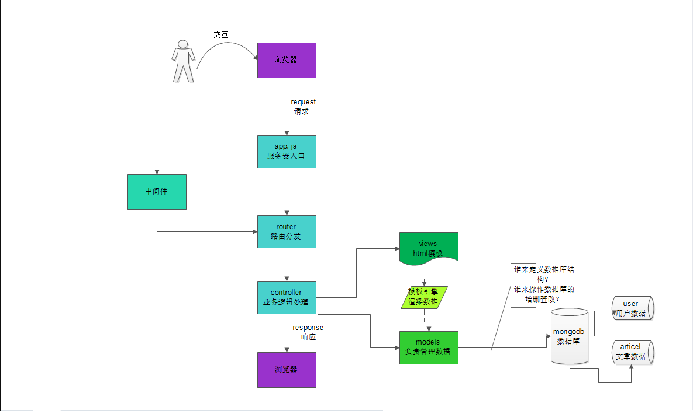


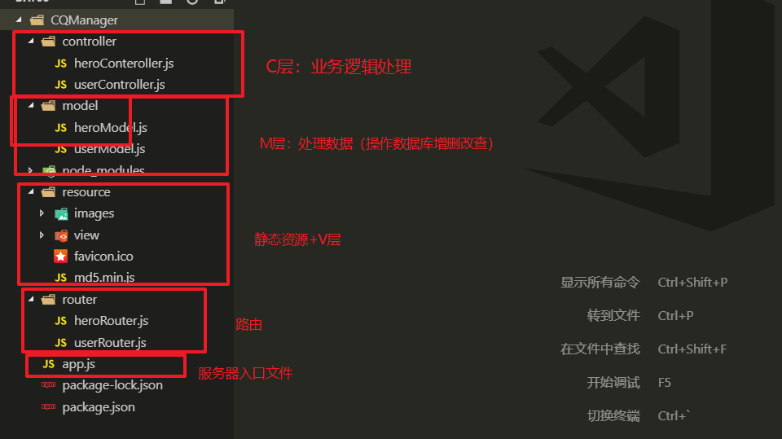

# 08-使用express搭建服务器入口文件app.js


* **搭建完毕之后直接浏览器输入网址测试**


```javascript
//1.导入模块
const express = require('express');
//2.创建服务器
let app = express();

//3.配置中间件

//3.1 托管静态资源
app.use('/resource', express.static(__dirname + '/resource'));
app.use('/node_modules', express.static(__dirname + '/node_modules'));
//3.2 body-parser:post参数解析
var bodyParser = require('body-parser');
// parse application/x-www-form-urlencoded
app.use(bodyParser.urlencoded({
    extended: false
}));
//3.3 serve-favicon:网站图标
var favicon = require('serve-favicon');
var path = require('path');
app.use(favicon(path.join(__dirname, 'resource', 'favicon.ico'))); //网站图标路径


//4.开启服务器
app.listen(3000, () => {
    console.log('success');
});
```


# 09-设计路由分发给MVC层

* ***记住：一旦在路由中分发给C层，那么C层这个方法就要定义，否则程序会报错提示你找不到这个方法***
  * 同理，一旦在C层导入了M层，那么M层也要定义

## 1.1-heroRouter.js

```javascript
//1.导入express
const express = require('express');
//2.创建路由app
let app = express();

//分发请求给C层
const heroController = require('../controller/heroConteroller.js');
app.get('/',heroController.showHeroList)//重定向显示首页
.get('/heroList',heroController.getHeroList)//获取所有英雄列表
.get('/heroPage',heroController.getHeroPageList)//分页查询英雄列表
.get('/heroSearch',heroController.getHeroSearchList)//搜索英雄
.post('/heroAdd',heroController.doHeroAdd)//添加英雄 
.get('/heroInfo',heroController.getHeroInfo)//查询英雄
.post('/heroUpdate',express.upload.single('icon'),heroController.doHeroUpdate)//编辑英雄
.get('/heroDelete',heroController.doHeroDelete);//删除英雄

//3.导出路由
module.exports = app;
```


## 1.2-heroController.js


```javascript
//导入M层
const heroModel = require('../model/heroModel.js');
//导出C层
module.exports = {
    showHeroList:(req,res)=>{
    },
    getHeroList:(req,res)=>{//英雄列表
    },
    getHeroPageList:(req,res)=>{
    },
    getHeroSearchList:(req,res)=>{
    },
    doHeroAdd:(req,res)=>{ 
    },
    getHeroInfo:(req,res)=>{
    },
    doHeroUpdate:(req,res)=>{
    },
    doHeroDelete:(req,res)=>{
    }
};
```


## 1.3-heroModel.js


```javascript
//1.导入模块
const mongoose = require('mongoose');

//2.连接数据库
mongoose.connect('mongodb://127.0.0.1:27017/CQManager');

//3.创建Model

let hero = mongoose.model('heros',{name:String,icon:String,skill:String});

//4.导出Model
module.exports = hero;
```


## 2.1-userRouter.js

```javascript
//1.导入express
const express = require('express');
//2.创建路由app
let app = express();

//分发请求给C层
const userController = require('../controller/userController.js');
app.post('/register',userController.register)//注册
.post('/login',userController.login)//登录
.get('/logout',userController.logout)//登出
.get('/captcha',userController.captcha);//验证码

//3.导出路由
module.exports = app;
```


## 2.2-userController.js

```javascript
const svgCaptcha = require('svg-captcha'); //导入验证码中间件

let captchaTxt; //声明一个全局变量存储服务端生成的验证码文本

//导入M层
const userModel = require('../model/userModel.js');

//导出C层
module.exports = {
    register: (req, res) => {
    },
    login: (req, res) => {
    },
    logout: (req, res) => {
    },
    captcha: (req, res) => {
    }
};
```


## 2.3-userModel.js


```javascript
//1.导入模块
const mongoose = require('mongoose');

//2.连接数据库
mongoose.connect('mongodb://127.0.0.1:27017/CQManager');

//3.创建Model

let user = mongoose.model('users',{userName:String,passWord:String});

//4.导出Model
module.exports = user;
```


## app.js中使用路由中间件


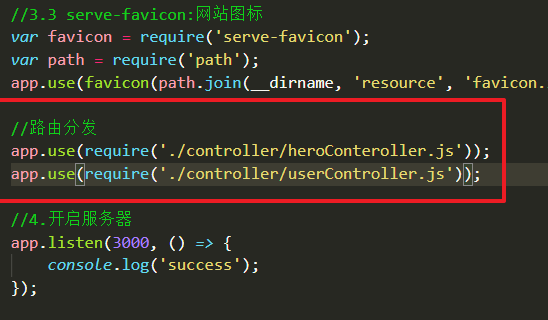


